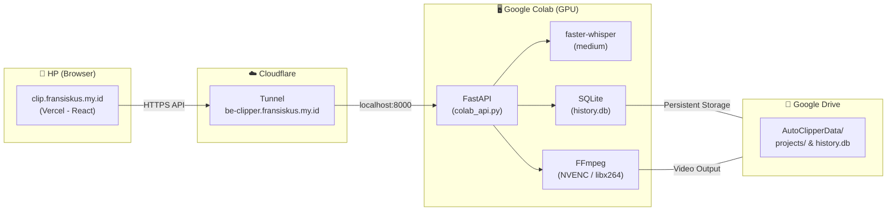
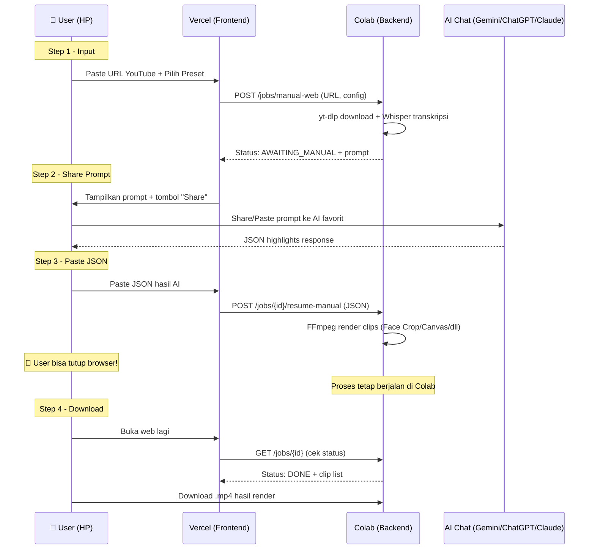

# Auto Clipper Cloud — Vercel + Google Colab

> **Superseded:** Desain operasional terbaru ada di docs/superpowers/specs/2025-11-15-colab-t4-drive-vercel-face-tracking-design.md (Potongan.id Cloud v2).

Transisi Auto Clipper dari Aplikasi Desktop (Tauri) menjadi **Mobile Web App** yang bisa diakses dari browser HP, dengan backend berjalan di GPU Google Colab secara gratis.

**Domain:**
- Frontend (Vercel): `clip.fransiskus.my.id`
- Backend (Cloudflare Tunnel → Colab): `be-clipper.fransiskus.my.id`

---

## User Review Required

> [!WARNING]
> **Tidak Ada Upload File Video Lokal**
> Versi web ini murni hanya menerima input **URL** (YouTube, TikTok, Instagram, X/Twitter). Fitur upload file dari HP tidak disediakan di V1. Video akan diunduh langsung oleh Colab via `yt-dlp`.

> [!IMPORTANT]
> **Static Password**
> API backend di Colab terekspos ke internet publik via Cloudflare Tunnel. Kita akan memasang **Static Password** (`AUTO_CLIPPER_WEB_TOKEN`) sebagai proteksi. Saat pertama kali buka web, kamu diminta masukkan password ini sekali, lalu disimpan di `localStorage` browser.

> [!IMPORTANT]
> **Versi Desktop Tidak Terpengaruh**
> Semua perubahan ini **tidak merusak** versi Desktop (Tauri) yang sudah ada. Kode backend tetap kompatibel untuk kedua mode (Desktop & Cloud). Frontend web dibuat di folder terpisah (`web/`).

---

## Arsitektur & Alur Kerja

### Diagram Arsitektur



### Alur Kerja dari HP (Single-Page Wizard)



---

## Proposed Changes

### Fase 1: Backend — Adaptasi untuk Google Colab

---

#### [MODIFY] [db.py](file:///c:/Users/dhima/projects/auto-clipper/backend/db.py)

Mengubah `get_app_data_dir()` agar mendukung *Environment Variable* `AUTO_CLIPPER_WORKSPACE`:

```python
def get_app_data_dir():
    # Cloud mode: jika env var di-set (misal ke /content/drive/MyDrive/AutoClipperData)
    custom_ws = os.environ.get("AUTO_CLIPPER_WORKSPACE")
    if custom_ws:
        os.makedirs(custom_ws, exist_ok=True)
        return custom_ws
    
    # Desktop mode: behavior lama (AppData/Library/etc)
    home = os.path.expanduser("~")
    # ... (kode existing tetap sama)
```

Dengan ini, saat dijalankan di Colab dengan `AUTO_CLIPPER_WORKSPACE=/content/drive/MyDrive/AutoClipperData`, semua file (database, projects, video output) akan tersimpan di Google Drive secara otomatis.

---

#### [MODIFY] [main.py](file:///c:/Users/dhima/projects/auto-clipper/backend/main.py)

**3 perubahan:**

1. **CORS — Tambahkan domain Vercel:**
```python
app.add_middleware(
    CORSMiddleware,
    allow_origin_regex=r"https?://([a-zA-Z0-9_.-]+\.)?localhost(:\d+)?|https?://127\.0\.0\.1(:\d+)?|tauri://.*|app://.*|https://clip\.fransiskus\.my\.id",
    allow_credentials=True,
    allow_methods=["*"],
    allow_headers=["*"],
)
```

2. **Auth Middleware — Dukung mode Cloud (non-frozen tapi tetap butuh token):**
```python
@app.middleware("http")
async def verify_token(request: Request, call_next):
    path = request.url.path
    if request.method == "OPTIONS" or path.startswith("/video") or path in ["/health", "/heartbeat"]:
        return await call_next(request)
    
    # Cloud mode: selalu verifikasi token jika env var CLOUD_MODE di-set
    cloud_mode = os.environ.get("AUTO_CLIPPER_CLOUD_MODE", "")
    if not getattr(sys, 'frozen', False) and not cloud_mode:
        return await call_next(request)  # Dev mode lokal, skip
    
    auth_header = request.headers.get("Authorization")
    if not auth_header or auth_header != f"Bearer {API_SECRET_TOKEN}":
        return JSONResponse(status_code=401, content={"status": "error", "message": "Unauthorized"})
    return await call_next(request)
```

3. **Watchdog — Nonaktifkan di Cloud mode:**
Di block `if __name__ == "__main__"` (atau di `colab_api.py`), watchdog thread yang memanggil `check_watchdog_condition` dan `is_parent_alive` **tidak akan dijalankan** saat `AUTO_CLIPPER_CLOUD_MODE` aktif, karena tidak ada proses parent Tauri.

---

#### [NEW] [colab_api.py](file:///c:/Users/dhima/projects/auto-clipper/backend/colab_api.py)

Script *entry-point* khusus untuk menjalankan backend di Google Colab. Tugasnya:

1. Men-set environment variables:
   - `AUTO_CLIPPER_WORKSPACE` → path Google Drive
   - `AUTO_CLIPPER_CLOUD_MODE` → `"1"`
   - `AUTO_CLIPPER_DEV_TOKEN` → static password yang ditentukan user
2. Menjalankan `uvicorn backend.main:app --host 0.0.0.0 --port 8000` sebagai subprocess.
3. Menjalankan `cloudflared tunnel run` dengan token Cloudflare sebagai subprocess paralel.
4. Memonitor kedua proses dan mencetak log ke console Colab.

```python
"""
Entry-point untuk menjalankan Auto Clipper backend di Google Colab.
Jalankan dari root repo: python -m backend.colab_api
"""
import os, sys, subprocess, signal

# --- Konfigurasi ---
GDRIVE_WORKSPACE = "/content/drive/MyDrive/AutoClipperData"
CLOUDFLARE_TOKEN = os.environ.get("CF_TUNNEL_TOKEN", "")
WEB_TOKEN = os.environ.get("AUTO_CLIPPER_WEB_TOKEN", "ganti-dengan-password-kamu")

def main():
    os.makedirs(GDRIVE_WORKSPACE, exist_ok=True)
    os.environ["AUTO_CLIPPER_WORKSPACE"] = GDRIVE_WORKSPACE
    os.environ["AUTO_CLIPPER_CLOUD_MODE"] = "1"
    os.environ["AUTO_CLIPPER_DEV_TOKEN"] = WEB_TOKEN

    # Jalankan FastAPI
    api_proc = subprocess.Popen([
        sys.executable, "-m", "uvicorn", "backend.main:app",
        "--host", "0.0.0.0", "--port", "8000"
    ])

    # Jalankan Cloudflare Tunnel
    cf_proc = subprocess.Popen([
        "cloudflared", "tunnel", "run", "--token", CLOUDFLARE_TOKEN
    ])

    # Tunggu salah satu proses selesai
    try:
        api_proc.wait()
    except KeyboardInterrupt:
        api_proc.send_signal(signal.SIGTERM)
        cf_proc.send_signal(signal.SIGTERM)

if __name__ == "__main__":
    main()
```

---

#### [NEW] [Auto_Clipper_Colab.ipynb](file:///c:/Users/dhima/projects/auto-clipper/Auto_Clipper_Colab.ipynb)

Notebook Google Colab yang tinggal **Run All**. Isi sel-selnya:

**Cell 1 — Mount Google Drive:**
```python
from google.colab import drive
drive.mount('/content/drive')
```

**Cell 2 — Clone Repo & Install Dependencies:**
```bash
%%bash
# Clone repo (atau pull jika sudah ada)
if [ ! -d "/content/auto-clipper" ]; then
  git clone https://github.com/DhimasPH/auto-clipper.git /content/auto-clipper
else
  cd /content/auto-clipper && git pull
fi

# Install system dependencies
apt-get update -qq && apt-get install -y -qq ffmpeg

# Install Python dependencies
pip install -q -r /content/auto-clipper/backend/requirements.txt
pip install -q uvicorn[standard] cloudflared
```

**Cell 3 — Set Token & Jalankan Server:**
```python
import os
os.environ["CF_TUNNEL_TOKEN"] = "TOKEN_CLOUDFLARE_KAMU"  # Ganti!
os.environ["AUTO_CLIPPER_WEB_TOKEN"] = "password-kamu"    # Ganti!

%cd /content/auto-clipper
!python -m backend.colab_api
```

---

### Fase 2: Frontend Web — Mobile-First Single-Page Wizard

---

#### [NEW] Direktori `web/`

Inisialisasi project React + Vite + Tailwind CSS (sesuai aturan AGENTS.md) di folder `web/`:

```
web/
├── package.json
├── vite.config.ts
├── tailwind.config.js
├── index.html
├── public/
└── src/
    ├── main.tsx
    ├── App.tsx              # Single-page wizard (4 steps)
    ├── api.ts               # HTTP client ke be-clipper.fransiskus.my.id
    ├── types/
    │   ├── subtitle.ts      # Re-export dari ../../src/types/subtitle.ts (atau copy)
    │   └── canvas.ts        # Re-export dari ../../src/types/canvas.ts (atau copy)
    ├── components/
    │   ├── AuthGate.tsx      # Form password (Static Token)
    │   ├── StepInput.tsx     # Step 1: URL + Gaya Output + Subtitle Preset
    │   ├── StepPrompt.tsx    # Step 2: Tampilkan prompt + Share/Copy
    │   ├── StepPaste.tsx     # Step 3: Textarea paste JSON + Render
    │   ├── StepResult.tsx    # Step 4: Preview + Download clips
    │   ├── OutputStyleSelector.tsx  # 4 pilihan gaya visual
    │   └── SubtitlePresetBar.tsx    # 3 preset: Classic/Podcast/Viral Pop
    ├── hooks/
    │   ├── useJobPolling.ts  # Polling status job + localStorage persistence
    │   └── useAuth.ts        # Token management di localStorage
    └── locales/
        ├── id.json
        └── en.json
```

---

#### Komponen-Komponen Utama

##### `App.tsx` — Single-Page Wizard

Satu halaman dengan 4 step. Tidak ada routing, tidak ada redirect. State dikelola di satu komponen:

```
Step 1 (Input) → Step 2 (Prompt) → Step 3 (Paste JSON) → Step 4 (Hasil)
```

Saat web dibuka ulang, `useJobPolling` memeriksa `localStorage` untuk job yang belum selesai:
- Jika ada job `AWAITING_MANUAL` → langsung loncat ke Step 2.
- Jika ada job `PROCESSING` → langsung loncat ke Step 4 (loading).
- Jika ada job `DONE` → langsung loncat ke Step 4 (hasil).

##### `AuthGate.tsx` — Login Sederhana

Form satu kolom password. Token disimpan di `localStorage("ac_web_token")`. Setiap request API menyertakan header `Authorization: Bearer <token>`. Jika server merespons `401`, tampilkan ulang form login.

##### `OutputStyleSelector.tsx` — Pilihan Gaya Output

4 tombol visual besar (*touch-friendly*):

| Pilihan | `aspect_ratio` | `canvas_config.enabled` | `background_type` | Keterangan |
|---|---|---|---|---|
| 🎯 **Face Crop** | `9:16` | `false` | — | Crop + face tracking |
| 🧊 **Canvas Blur** | `9:16` | `true` | `blur` | Video utuh + background blur |
| 🖥️ **Landscape** | `16:9` | `false` | — | Tetap horizontal |
| ⬜ **Square** | `1:1` | `false` | — | Crop tengah / face tracking |

Jika user memilih **Canvas Blur**, muncul sub-opsi:
- Intensitas: `Light` / `Medium` / `Strong`
- Background alternatif: `Blur` / `Solid Color` (color picker)
- Zoom: `1.0x` / `1.2x` / `1.5x` / `2.0x`

##### `SubtitlePresetBar.tsx` — Reuse Preset yang Sudah Ada

3 tombol preset (langsung dari `SUBTITLE_PRESETS` di kode existing):

| Preset | Style | Font | Efek |
|---|---|---|---|
| 🎤 **Viral Pop** (default) | Single Word Pop | Impact, UPPERCASE | Pop animation, outline 3, shadow 5 |
| 📺 **Podcast** | Karaoke highlight | Montserrat, bold | Outline 2, shadow 2 |
| 📝 **Classic** | Standard sentence | Arial, normal | Outline 2, shadow 1 |

Di bawahnya: tombol **"Advanced"** (collapsed) untuk mengubah:
- Warna highlight (6 preset: Yellow/Cyan/Lime/Pink/White/Orange)
- Watermark text & opacity

##### `StepPrompt.tsx` — Share Prompt (AI-Agnostic)

Menampilkan prompt yang sudah di-generate backend (`job.metadata.manual_prompt`). Dua tombol:

1. **📤 Share Prompt** — Menggunakan `navigator.share()` (Web Share API). Di HP, membuka *native share sheet* bawaan OS. User bisa pilih aplikasi apapun: Gemini, ChatGPT, Claude, WhatsApp, Notes, dll.
2. **📋 Copy Prompt** — Fallback jika Web Share API tidak didukung. Menggunakan `navigator.clipboard.writeText()`.

##### `StepResult.tsx` — Preview & Download

Menampilkan daftar klip yang sudah jadi:
- Video player inline (`<video>` tag, src = `https://be-clipper.fransiskus.my.id/video?path=...`)
- Tombol **Download** per klip (menggunakan `<a download>` atau `fetch` + `blob`)
- Info deskripsi klip (dari JSON AI)

---

#### `api.ts` — HTTP Client

```typescript
const API_BASE = "https://be-clipper.fransiskus.my.id";

async function apiFetch(path: string, options?: RequestInit) {
  const token = localStorage.getItem("ac_web_token") || "";
  const res = await fetch(`${API_BASE}${path}`, {
    ...options,
    headers: {
      "Content-Type": "application/json",
      "Authorization": `Bearer ${token}`,
      ...options?.headers,
    },
  });
  if (res.status === 401) {
    // Token salah, redirect ke auth gate
    localStorage.removeItem("ac_web_token");
    window.location.reload();
    throw new Error("Unauthorized");
  }
  return res.json();
}
```

---

### Fase 3: Konfigurasi Infrastruktur

---

#### Cloudflare Tunnel Setup (Sekali)

1. Buka **Cloudflare Zero Trust Dashboard** → Networks → Tunnels.
2. Buat tunnel baru: `colab-clipper`.
3. Tambahkan **Public Hostname**:
   - Subdomain: `be-clipper`
   - Domain: `fransiskus.my.id`
   - Service: `http://localhost:8000`
4. Salin **Tunnel Token** → tempel di Cell 3 notebook Colab.

#### Vercel Deploy Setup (Sekali)

1. Import repo `DhimasPH/auto-clipper` ke Vercel.
2. Set **Root Directory** ke `web`.
3. Framework Preset: `Vite`.
4. Environment Variable: `VITE_API_URL` = `https://be-clipper.fransiskus.my.id`.
5. Custom Domain: `clip.fransiskus.my.id`.

---

## Job Persistence — Tutup Browser, Proses Tetap Jalan

### Mekanisme Teknis:

1. **Saat job dimulai:** Frontend menyimpan `job_id` ke `localStorage("ac_active_job")`.
2. **Saat web ditutup:** Tidak ada efek ke backend. Colab tetap memproses.
3. **Saat web dibuka kembali:**
   - `useJobPolling` membaca `localStorage("ac_active_job")`.
   - Memanggil `GET /jobs/{job_id}` ke backend.
   - Jika job masih ada di *in-memory queue*: tampilkan progress real-time.
   - Jika job sudah selesai dan masuk `history`: tampilkan hasil dari `GET /history`.
   - Jika backend tidak merespons (Colab mati): tampilkan pesan error + tombol retry.
4. **Saat job selesai:** Hapus `localStorage("ac_active_job")`, tampilkan hasil.

### Penanganan Edge Case:

| Skenario | Behavior |
|---|---|
| Tutup browser saat Whisper jalan | Whisper tetap jalan. Buka lagi → lihat status. |
| Tutup browser saat render FFmpeg | FFmpeg tetap jalan. Buka lagi → lihat progress. |
| Colab mati saat render | Job gagal. Database tetap aman di Google Drive. Nyalakan Colab → retry. |
| Buka web tapi Colab belum nyala | Tampilkan "Server offline. Nyalakan Colab dulu." |

---

## Verification Plan

### Automated Tests
```bash
# Backend: pastikan kode existing tidak rusak
cd backend && pytest tests/
```

### Manual Verification

1. **Backend di Colab:**
   - Jalankan notebook di Google Colab.
   - Verifikasi `be-clipper.fransiskus.my.id/health` merespons `{"status": "ok"}`.
   - Verifikasi `history.db` terbentuk di Google Drive.
   - Test endpoint `POST /jobs/manual` dengan URL YouTube pendek (< 2 menit).

2. **Frontend di Local Dev:**
   - `cd web && npm run dev`
   - Buka di browser HP (via IP lokal atau ngrok).
   - Test full flow: URL → Transcribe → Copy Prompt → Paste JSON → Render → Download.

3. **Frontend di Vercel:**
   - Deploy ke `clip.fransiskus.my.id`.
   - Test full flow dari browser HP sungguhan.
   - Verifikasi: tutup browser → buka lagi → job masih terlihat.

4. **Security:**
   - Akses `be-clipper.fransiskus.my.id/history` tanpa token → harus dapat `401 Unauthorized`.
   - Akses dengan token salah → harus dapat `401`.
   - Akses dengan token benar → harus dapat data.
